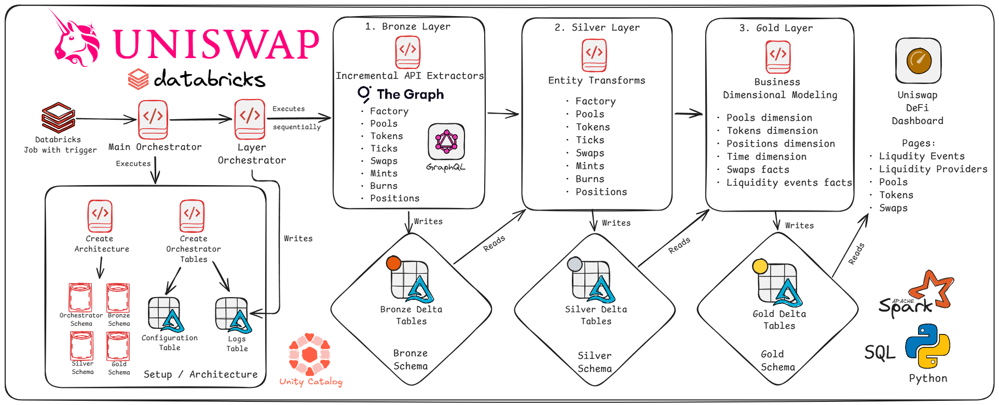
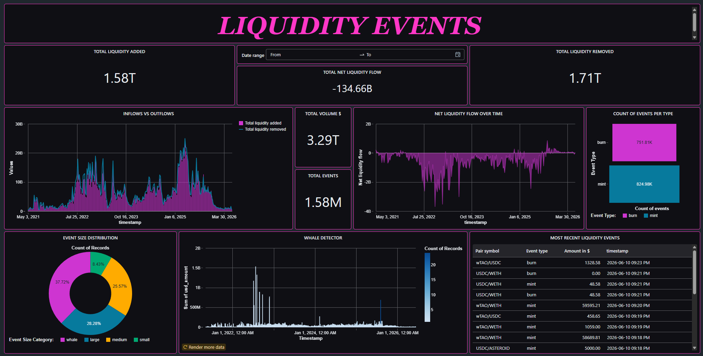
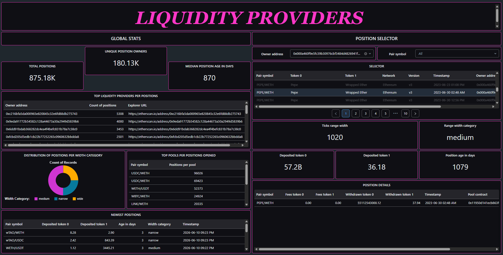
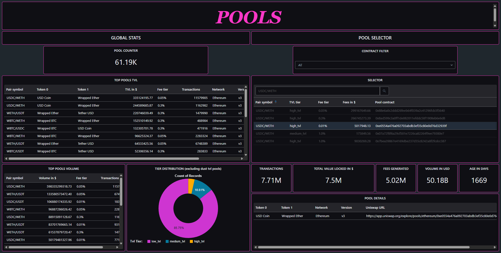
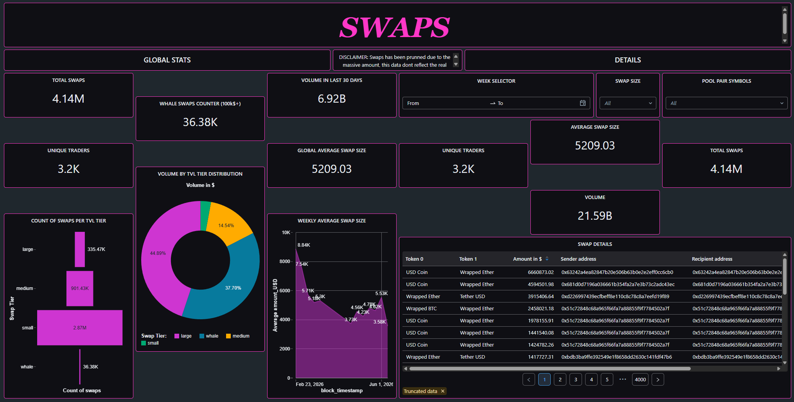
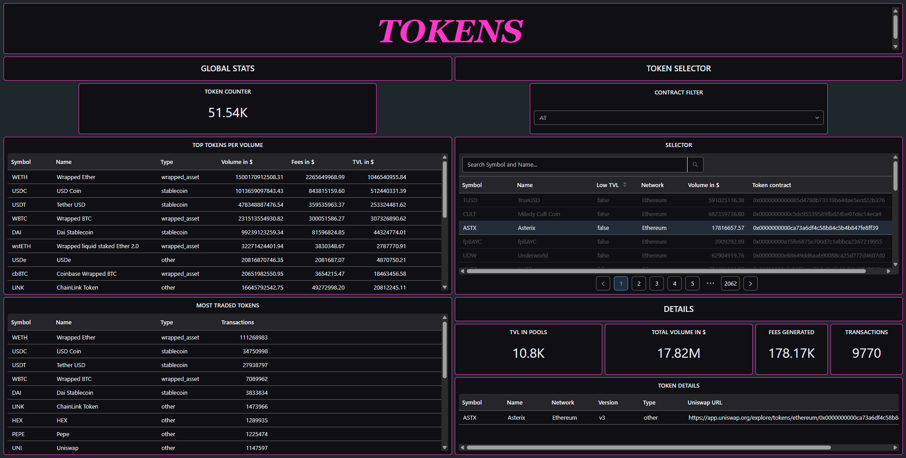

# Uniswap DeFi Data Platform
## Introdution
This project provides a data architecture designed to extract and analyze Uniswap data, offering a tool for DeFi enthusiasts who want a deeper understanding of what's happening on-chain.

I've always been interested in DeFi and how the vast amount of data is handled behind the scenes, since the UX rarely shows the full picture. So I decided to build something on my own, while practicing my data engineering skills along the way.

This project is just a Proof of Concept. It took me around 3-4 months, working on it in my free time outside my full-time job as a Data Engineer.

This documentation is meant to provide context for non-technical readers as well, so it's not a deep technical reference, even though I'll go into detail on some parts.

I hope you enjoy it, and feel free to suggest improvements, fork it, or contribute if you'd like.  
Thank you.

---
## Project overview
This section covers the scope, technologies used, high-level architecture of the platform and some other topics related to the decision-making behind the project.

#### · Scope
As a Proof of Concept, the scope of this project was to build an end-to-end data platform extracting data only from Uniswap version 3 (rather than version 2) and only from the Ethereum mainnet, for these reasons:
- Version 3 introduced a key feature that makes it especially interesting: Concentrated Liquidity.
- Ethereum mainnet is where most of the value is locked, so I decided to leave other chains out of scope for now.

Additionally, the scope is limited to analyzing everything related to the existing liquidity within a pool. This includes tokens, swaps between them, ticks, liquidity events such as mints and burns, and liquidity providers data (the owners of the liquidity within a pool). Everything else is excluded.

#### · Tech stack
These are the main technologies I used to develop the project: 

- **Databricks Free Edition** as the development platform
- **Uniswap V3 Subgraph** (via The Graph) as the main data source
- **PySpark** and **SparkSQL** as the primary languages
- **GraphQL** to query the Subgraph API
- **Delta Lake** to store all tables
- **Unity Catalog** to govern and manage them

#### · Architecture diagram

#### · Diagram walkthrough
The orchestration starts with a Databricks Job triggered twice a week, which runs the Main Orchestrator. This component sets up the environment and determines which layers need to be executed. It then triggers the Layer Orchestrator, which runs each layer sequentially: Bronze, Silver, and finally Gold. Once the Gold layer is ready, the data can be explored through the Dashboard.

#### · Load strategy, compute and partitioning
**Loads:** To bring some context, The Graph's Free Plan provides 100,000 free queries, so I decided to run the pipeline twice a week. This meant I couldn't retrieve all the data on every run, so incremental loads were the only viable option for the Bronze layer entities, retrieving only new rows and appending them to the existing ones, building the full history over time. The platform already provides differential loads using a sort of primary key to identify rows, which are then merged with the existing data.

For the Silver and Gold layers, all existing data is reprocessed on every run, since the size of the Bronze layer entities isn't large enough to make a meaningful difference between a full load and a differential one.

I'd like to highlight that for some entities, such as Swaps, I had to prune the extraction by filtering only swaps from relevant pools (selecting only those with decent amount of total value locked, a minimum number of swaps, and so on) to avoid overloading the query threshold. This is tackled below.

**Compute:** Databricks Free Edition only supports Serverless compute, so I wasn't able to deploy a cluster to optimize the processing workloads. 

**Partitioning:** There was no need to partition any table, since, again, the size of the tables was small enough to be handled efficiently by Delta Lake. As an example, the Swaps table is around ~5GB. The actual bottleneck was the number of API queries, not the storage layer. Databricks recommends not partitioning tables smaller than 500GB, so there's still a long way to go before that becomes a concern.

---
## Medallion architecture explanation
#### · Orchestration
#### · Bronze
#### · Silver
#### · Gold
---
## Uniswap Data Model

The entities below are extracted directly from the Uniswap V3 Subgraph, using the same names and structure defined in [Uniswap's official documentation](https://developers.uniswap.org/docs/ecosystem/subgraphs/concepts/v3/entities). For a complete field-by-field breakdown, refer to that documentation; this section focuses on what each entity represents and the role it plays in this project.

On top of these entities, a dimensional model was built in the Gold layer, composed of four dimensions, Pools, Tokens, Positions, and Time, and two fact tables, Swaps and Liquidity Events, built by combining Mints and Burns.

#### · Factory
A single-row entity representing protocol-wide aggregated statistics, such as total pools created, total transactions, total fees, and total value locked across the entire Uniswap V3 deployment. Rather than becoming a dimension on its own, it's used as contextual reference data, such as network and protocol version, across other Gold tables.

#### · Pools
Represents each liquidity pool, the core unit of Uniswap where a pair of tokens is traded, holding metrics such as total value locked, volume, fees, and fee tier. This entity becomes the **Pools dimension**, enriched with attributes like TVL tier, pool age, and the token pair symbol.

#### · Tokens
Represents each ERC-20 token traded on the protocol, including metrics like volume, total value locked, and derived price in ETH. This entity becomes the **Tokens dimension**, enriched with a classification distinguishing stablecoins, wrapped assets, and other tokens.

#### · Ticks
Represents discrete price points within a pool, the foundation of Concentrated Liquidity, since each tick marks a boundary where liquidity providers can choose to allocate their funds. This entity stays at the Silver layer, supporting price-range context, but isn't promoted into its own Gold table.

#### · Swaps
Represents a trade between two tokens within a pool. Only swaps from relevant pools and with a non-zero USD amount are extracted, as explained in the Load strategy section. This entity becomes the **Swaps fact table**, enriched with a swap size tier (small, medium, large, whale).

#### · Positions
Represents a liquidity provider's stake within a specific price range (between a lower and upper tick) of a pool. This entity becomes the **Positions dimension**, which is what powers the Liquidity Providers view on the dashboard, enriched with a position width category (narrow, medium, wide).

#### · Mints
Represents a liquidity addition event, when a provider deposits tokens into a position. Together with Burns, this entity feeds the **Liquidity Events fact table**.

#### · Burns
Represents a liquidity removal event, when a provider withdraws tokens from a position. Combined with Mints, both events are unioned into the **Liquidity Events fact table**, with mints contributing a positive liquidity delta and burns a negative one, plus an event size category (small, medium, large, whale).

---
## Dashboard showcase
#### Access URL
**[Uniswap_DeFi_Dashboard](https://dbc-d5e8e1ea-6197.cloud.databricks.com/dashboardsv3/01f1511eafc51536930b59045bada187/published?o=2923669840284238)**

#### Liquidity Events

#### Liquidity Providers

#### Pools

#### Swaps

#### Tokens

---
## How to
#### · Use the dashboard
1. Create a Databricks Free Edition account with your email.
2. Once done, open the link provided in this documentation or in the About section to access the dashboard.

#### · Run your own version of the platform
1. Create a Databricks Free Edition account with your email.
2. Clone the repository into a Repo folder.
3. You'll need an API key and the subgraph ID, stored as Databricks secrets. You can get these by creating an account on The Graph, connecting your EVM wallet, and generating an API key.
4. Use the notebook called `manage_databricks_secrets`, inside the `00_architecture` folder, to create these secrets. Remember to paste your Databricks Host URL and your API key, the Subgraph ID is already included in the notebook.
5. Create a Databricks Job using the `medallion_job_declaration` YAML file found in the repository.
    - Change the relative paths of both tasks that run each orchestrator from mine to yours. For example, mine is `/Workspace/Users/mariojuradogalan@outlook.com/uniswap-defi-data-platform/00_orchestrators/main_orchestrator`, so you should replace my email with yours.
    - Change the email notification from mine to yours.
6. Go to the Tasks tab within the Job, select `main_orchestrator`, and set the `create_architecture` and `create_orchestrator_tables` parameters to **true**, so the platform creates everything it needs to run properly the first time. Remember to set them back to **false** once you've run it for the first time.
7. Run the job manually, or wait for it to trigger automatically every Wednesday and Sunday.
8. If you want to modify the load behavior, add new entities, or anything else, you'll just need to update the `active_for_load` and `load_pattern` columns in the `uniswap.orchestrator.configuration` table.

---
## Challenges and learnings
#### · GraphQL & The Graph
I've mostly worked with structured data along my career, so extracting data from an API was a new challenge, especially since this one required GraphQL, which I hadn't used before. This was probably my biggest technical learning from the project.

Working with The Graph, I struggled with pagination and the skip limits, trying not to exceed the query threshold or overload the API with too many requests. The data types returned by the API were also tricky to manage sometimes.

#### · Diving into DeFi
Beyond the technical extraction challenges, this project taught me a lot about DeFi itself. I learned how liquidity events are actually generated, what data each entity stores, and which fields actually matter for analysis versus which are just noise. I was also surprised by how vast the amount of data generated really is, every swap, mint, and burn across thousands of pools adds up fast.

Diving into Concentrated Liquidity in particular gave me a much deeper understanding of how it works behind the scenes, down to a level of detail I hadn't expected, like how positions are defined within specific tick ranges rather than across the entire price curve, the way V2 pools work.

#### · Pool filtering thresholds
Deciding which pools were relevant enough to extract pushed me to understand which values actually mattered and why. Reaching the right thresholds wasn't straightforward, it took several iterations of testing, hitting errors, and adjusting until the logic made sense.

#### · Metadata-driven orchestration
I really enjoyed building a Medallion Architecture with a fully metadata-driven orchestration, one with dynamic behavior that adapts to new entities and scales to bigger scenarios. From the start, I didn't want to build something tied to just this one use case, this architecture could work for any project.

#### · Dashboard development
Building the dashboard was also a lot of fun. I'm not a Data Analyst, so creating visuals that conveyed useful information was harder than expected, even with this many tables to work with!

---
## Future improvements

This PoC was designed to cover only Uniswap V3 data on the Ethereum chain, running as an incremental batch load twice a week. There are several directions I'd like to take it further:

- **Protocol & chain coverage:** add the other Uniswap versions (V2, V4) and extract data from chains beyond Ethereum mainnet.
- **Near real-time:** migrate to Lakeflow Spark Declarative Pipelines for more accurate, up-to-date analysis.
- **Data model:** promote Ticks into the Gold layer to enable liquidity-depth analysis on the dashboard.
- **Engineering maturity:** add some data quality checks, and start deploying with Databricks Asset Bundles for CI/CD instead of managing notebooks by hand.

---
## Contact me
Whether you liked the project, want to ask something, contribute, or anything else, feel free to reach out to me:

📧 mariojuradogalan@outlook.com  
💼 [LinkedIn](https://www.linkedin.com/in/mariojuradogalan/)

